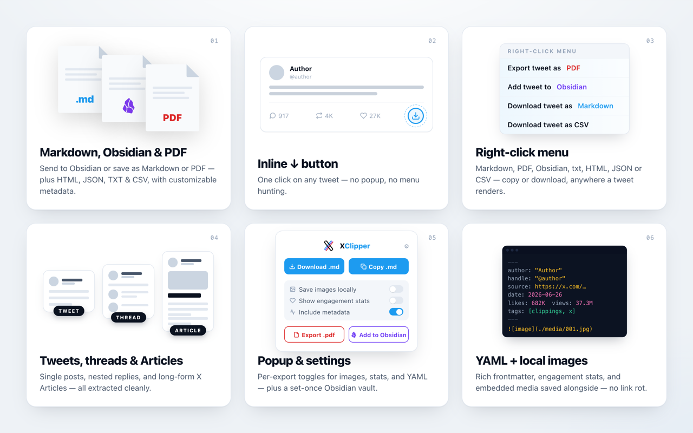
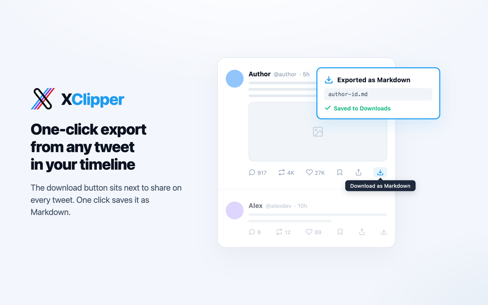
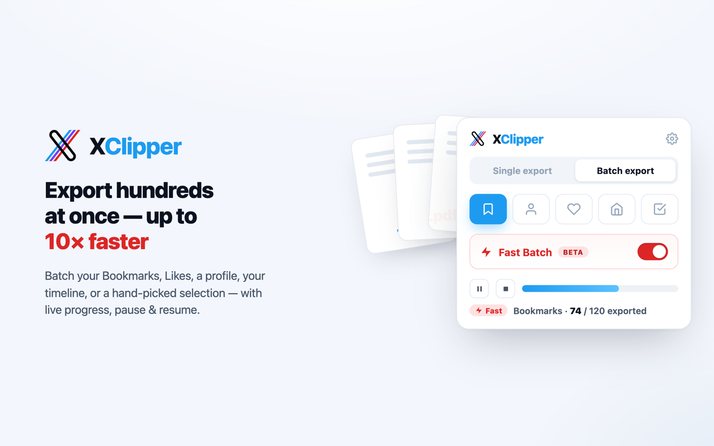
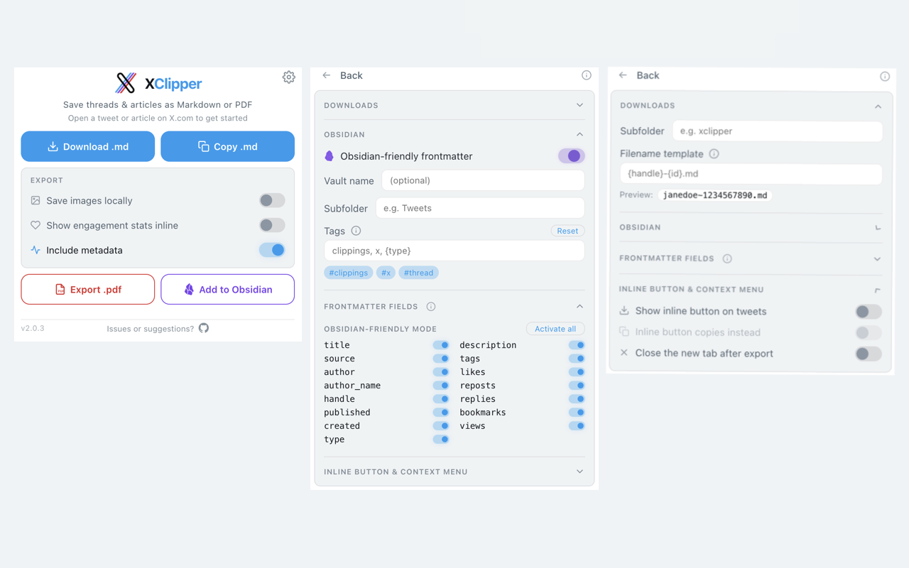

<h1 align="center">
  
</h1>

<p align="center"><em>The high-fidelity X / Twitter web clipper — save posts, threads & articles to Markdown, PDF, HTML, JSON, CSV & Obsidian, one at a time or in batch.</em></p>

<p align="center">
  <a href="https://github.com/zendegani/xclipper/actions/workflows/ci.yml"></a>
  <a href="LICENSE"></a>
  <a href="PRIVACY.md"></a>
</p>

<p align="center">
  <a href="src/manifest.json"></a>
  <a href="src/manifest.json"></a>
</p>

<p align="center">
  <a href="https://chromewebstore.google.com/detail/xclipper/epmmehilhbpkgcjbcohgkmihlalagkho"></a>
</p>

<p align="center">
  <a href="#why-xclipper">Why</a> · <a href="#features">Features</a> · <a href="#install">Install</a> · <a href="#usage">Usage</a> · <a href="#for-developers">For developers</a>
</p>

<p align="center">
  
</p>

**XClipper** is a source-available Chrome extension that exports x.com content as **Markdown, PDF, HTML, JSON, TXT, CSV, or Obsidian notes** — one post at a time, or in **batch** from your bookmarks, a profile, your likes, your home timeline, or a hand-picked selection. It runs entirely in your browser: no X API key, no account, no server. Free for noncommercial use ([commercial license](#license) required to sell or build a paid product on it).

## Why XClipper

Most "tweet to markdown" tools run a post through a generic HTML→Markdown converter and stop there. XClipper is built differently, and it shows up in four places:

- **Output you won't have to clean up.** The DOM is parsed into a typed **Content AST** before anything is rendered, so structure survives: nested threads, quote tweets, polls, link cards, and full long-form **Articles** (headings, lists, code blocks) all come through faithfully. `t.co` links are resolved to real URLs, emoji and @mentions stay intact, truncated posts are expanded, and engagement bars, follow prompts, and trackers are stripped.
- **Real PDFs, not screenshots.** PDF export goes through Chrome's native print engine — selectable text, clickable links, embedded images, and full Unicode/emoji — so the result is an actual document, not a flattened image.
- **Batch, not one-at-a-time.** Export your entire **Bookmarks**, **Likes**, a **Profile**, your home **Timeline**, or a hand-picked **Selection** in a single background job, with progress, pause/resume/stop, and dedup — plus an optional **Fast mode** that pulls items straight from your X session for a roughly **10× speed-up**.
- **100% local, zero setup.** No API keys, no accounts, nothing leaves your browser. Install and clip.

<p align="center">
  
</p>

## Features

### Headline

- **Batch export** — Export many posts at once from five sources via an icon tab strip: **Bookmarks**, **Profile** (own posts; reposts skipped), **Likes**, **Timeline** (every post loaded in your home feed), or **Selection** (tick individual tweets with checkboxes on any timeline). Pick the **format** and whether to write **Separate** per-post files, one **Combined** file (`x-compilation-<date>`), or **Both**. Runs in the background (one job at a time) with a live progress bar and **pause / resume / stop** — close and reopen the popup mid-job. A dedup ledger skips already-exported items, and you can keep adding newly-scrolled posts to a running job.
- **Fast Batch ⚡ (opt-in)** — An optional accelerated mode for **Bookmarks, Profile, and Likes** that fetches posts directly through your logged-in X session's internal API instead of rendering each page — roughly **10× faster** (minutes → seconds), mapped into the same output so every format and setting works identically. No API key, no password, nothing leaves your browser. Off by default; see [the caveats below](#fast-batch-opt-in) before enabling it.
- **Seven export formats** — Save a single post as **Markdown, PDF, HTML, JSON, TXT, or CSV**, or hand it to **Obsidian**. Batch jobs support all of these except PDF. CSV pairs your metadata columns with a `text` column for the post body.
- **High-fidelity Markdown** — Tweets, nested threads, quote tweets, polls, link cards, and X Articles render cleanly via the AST pipeline (no Turndown), with resolved `t.co` links, inlined emoji, and tidy @mentions.
- **True PDF export** — Tweets, threads, and articles printed through Chrome's native engine: selectable text, clickable links, embedded images, full Unicode.
- **Obsidian integration** — One-click handoff via the `obsidian://` URI scheme with optional vault targeting, plus an **Obsidian-friendly frontmatter** schema (`[[@handle]]` wikilinks, synthesized title, `published`/`created` dates, prose description, and a customizable tags list with `{`-autocomplete).
- **Local image downloads** — Save embedded X media next to your file to prevent link rot.

### Also included

- **Three ways to trigger** — Toolbar popup, an inline button on every tweet's action bar, and the right-click context menu.
- **Rich YAML frontmatter + field picker** — Author, handle, date, source URL, content type, and engagement stats — with per-field toggles, saved separately for the default and Obsidian-friendly schemas.
- **Customizable filename template** — Placeholders (`{date}`, `{datetime}`, `{handle}`, `{author}`, `{id}`, `{slug}`, `{type}`) with a live preview in Settings.
- **Single-tweet export** — Grab one tweet without its thread via the context menu or by Shift/Alt-clicking the inline button.

Plus: copy-to-clipboard or download · optional inline engagement-stats row (`💬 284 · 🔁 1.5K · ❤️ 8K · 🔖 253 · 👁 100K`) · 12-language UI (extraction works in any language) · light & dark mode.

### Inline button — one click on any tweet

<p align="center">
  
</p>

The download icon sits next to share on every tweet. One click opens the permalink in a new tab and exports it automatically. Toggle it to copy instead, and optionally close the tab once done.

### Right-click context menu

<p align="center">
  
</p>

Right-click anywhere on a tweet — body, image, or timestamp — and pick **Save tweet as Markdown**, **Copy tweet as Markdown**, or **Add tweet to Obsidian**. XClipper figures out which tweet you meant.

### Fast Batch (opt-in)

<p align="center">
  
</p>

⚡ Standard batch renders each post in a worker tab — reliable, no extra permissions, and the default. **Fast Batch** is an optional mode for **Bookmarks, Profile, and Likes** that instead replays X's own internal API using your existing logged-in session, turning a multi-minute job into a few seconds (~10×). It maps the same data into the same Content AST, so every format and setting behaves identically. (Timeline and Selection stay on Standard batch.)

What to know before turning it on:

- **It's opt-in and off by default.** Enabling it grants one optional, X.com-only permission (`webRequest`) used to read your session's auth header. There's no API key and no password — and nothing leaves your browser.
- **Use it judiciously.** Because it calls X's private API directly, large runs can trip X's rate limit (soft-blocking). Fast Batch paces itself and **stops politely** when X pushes back, so you can resume or re-run later.
- **Three fetch modes** (a `Recent | Resume | Date range` switch) control what each run pulls. **Recent** grabs your newest items from the top. **Resume** continues a large backfill from where it last stopped, so thousands of bookmarks export across several sessions without re-scanning what's done. **Date range** pulls only posts tweeted within a chosen window, crawling deeper each run on its own cursor (so it doesn't disturb a Resume backfill). A shared dedup history skips already-exported posts across all three; **Reset history** clears it.
- **Super Fast (skip threads)** — an extra toggle for when you want volume over depth. Fetching each post's thread is the step that hits X's rate limit and caps a normal run at ~150 posts; skipping it raises the budget to ~3000 posts per run, so a whole bookmarks feed exports in a go or two. The cost: a thread exports as its first post only (quotes, media, polls and long-post text still come through, and X Articles are still fetched in full). Posts exported this way count as done — **Reset history** if you later want them re-exported with full threads.
- **Two quick setup steps**, shown as step-lights in the popup: reload the page so its feed request is captured, and open any one tweet so threads and articles can be expanded.

### Settings — tune once, forget about it

<p align="center">
  
</p>

The popup keeps per-export toggles (**Save images locally**, **Show engagement stats inline**, **Include metadata**) front and centre. The gear icon opens **Settings**, where set-once knobs live in four collapsible sections — **Downloads**, **Obsidian**, **Frontmatter fields**, and **Inline button & context menu** — persisted across sessions via `chrome.storage`.

## Great For

- Importing X content into **Obsidian**, **Notion**, **Logseq**, **Hugo**, or any Markdown-based PKM system
- Exporting clean text for **LLM prompts**, **RAG pipelines**, or AI workflows
- Archiving research threads, news references, and long-form articles offline
- Building a searchable **Second Brain** from your Twitter/X activity
- Preparing source material for writing, translation, or summarization

## Install

### From the Chrome Web Store

Install **XClipper** from the [Chrome Web Store](https://chromewebstore.google.com/detail/xclipper/epmmehilhbpkgcjbcohgkmihlalagkho).

### From source

```bash
git clone https://github.com/zendegani/xclipper.git
cd xclipper
npm install
npm run build
```

Then open `chrome://extensions/` → enable **Developer mode** → **Load unpacked** → select `dist/`.

## Usage

Pick whichever entry point you prefer — they all run the same extractor and respect the same toggles:

- **Toolbar popup** — Click the XClipper icon, then **Download .md**, **Copy .md**, **Export .pdf**, or **Add to Obsidian** (more formats under the **More formats** row).
- **Inline button** — Click the download icon on any tweet's action bar (and at the top of long-form articles). Shift/Alt-click to export just that tweet without its thread.
- **Right-click menu** — Right-click any tweet and pick **Save tweet as Markdown**, **Copy tweet as Markdown**, or **Copy just this tweet (no thread)**.

Per-export toggles live in the main popup; set-once options live under the gear icon. See [Settings](#settings--tune-once-forget-about-it) above.

> **Add to Obsidian tip:** for long threads or content where you want images permanently archived, use **Download .md** with **Save images locally** and drag the resulting folder into your vault. The Obsidian deeplink is best for quick capture — it has an OS-level URL-length limit and leaves images as remote URLs.

Filenames default to `@handle-tweetId.md` (tweets/threads) or `@handle-article-slug.md` (articles), and are fully configurable via the filename template.

## Current Limitations

- Videos and GIFs are not exported as playable media files
- Requires a page reload if the extension was installed or updated after the tab was opened
- Some content may stop working if x.com changes its page structure significantly

---

## For developers

[Read the developer documentation in CONTRIBUTING.md.](CONTRIBUTING.md#for-developers)

## License

XClipper is **source-available** under the [PolyForm Noncommercial License 1.0.0](LICENSE) — not an OSI "open source" license.

- **Free** for any noncommercial use: personal, research, education, nonprofits, hobby projects.
- **Commercial use requires a paid license.** To sell XClipper (or a derivative), bundle it in a paid product, or otherwise use it commercially, contact the author to arrange a commercial license: [@zendegani](https://github.com/zendegani).

Copyright © 2026 Ali Zendegani.
