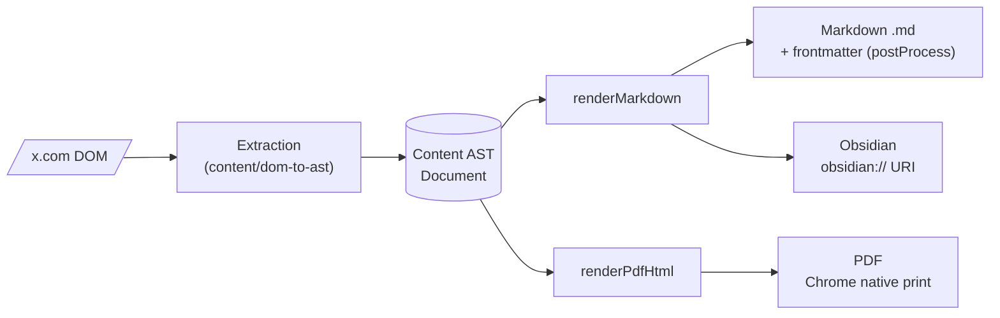
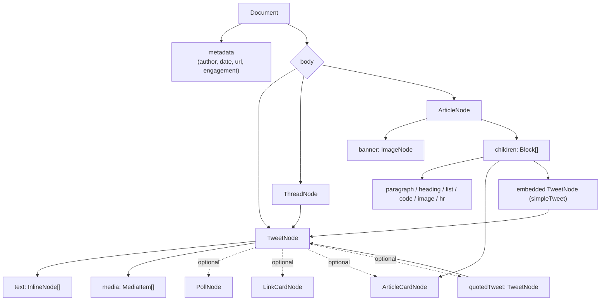
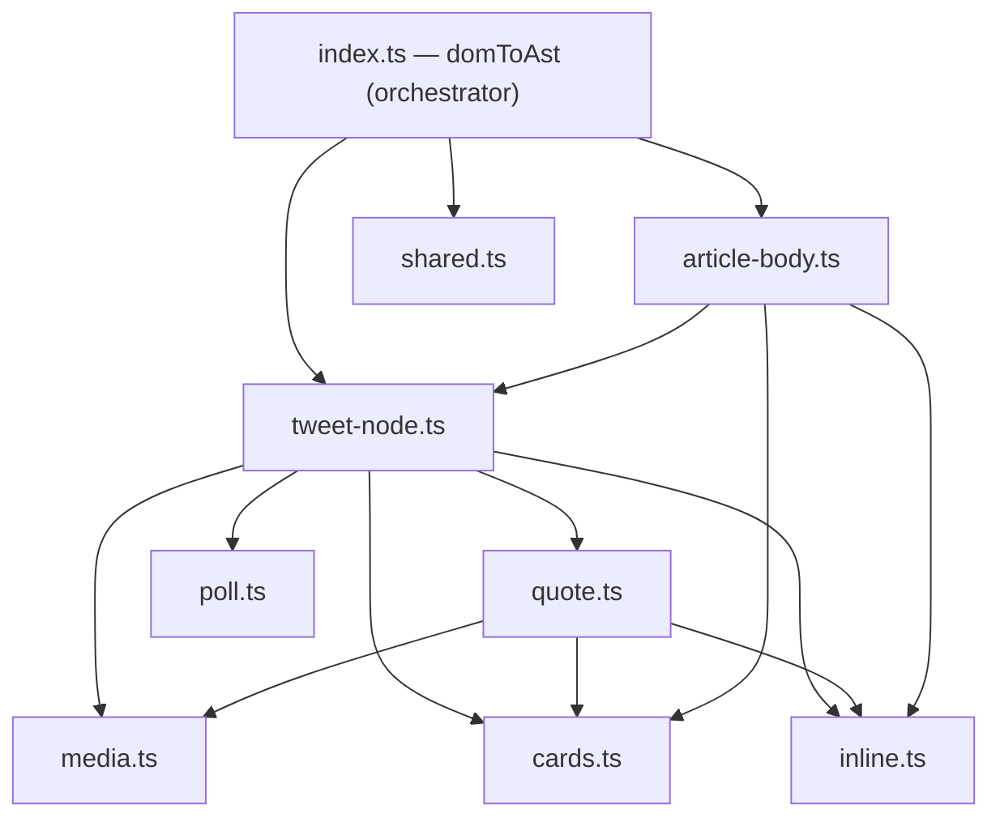
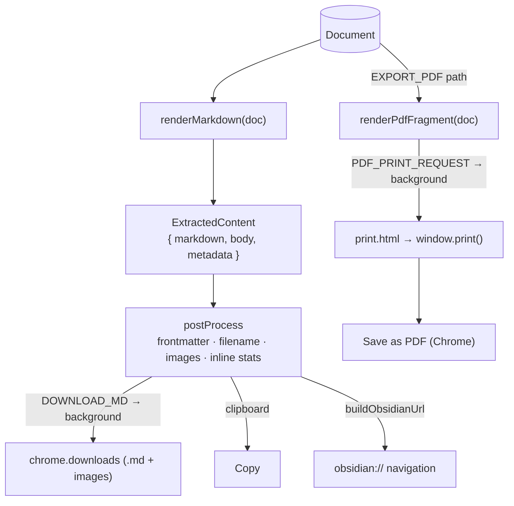
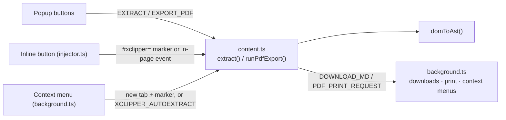
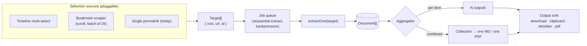

# XClipper architecture

A living overview of how XClipper turns x.com pages into Markdown, PDF, and
Obsidian notes — and how that design is meant to scale to multi-tweet and batch
export. For the per-node AST contract see [`ast-schema.md`](./ast-schema.md);
for *why* the AST exists see [`adr/0001`](./adr/0001-content-ast-architecture.md).

## The one diagram

Everything is one shape: **DOM → Content AST → renderers**. The AST is the only
source of truth; renderers never touch the DOM.



Three planes, each independently testable:

| Plane | Lives in | Input → Output | Knows about |
|---|---|---|---|
| **Extraction** | `content/dom-to-ast/` | DOM `Element` → `Document` | X's DOM quirks only |
| **Rendering** | `ast/` | `Document` → string (MD / HTML) | the AST only |
| **Orchestration** | `content/`, `popup/`, `background/` | user intent → message → file | Chrome APIs, settings |

The seam that makes scaling possible: `Document` is **JSON-serializable** and
already crosses the `chrome.runtime` message boundary inside `ExtractedContent`.
ASTs can be produced in one context, collected, and rendered in another.

## Content AST — node relationships

What gets extracted and how the nodes nest. Full field-level contract in
[`ast-schema.md`](./ast-schema.md).



Two recursions matter: a tweet can **quote** another tweet, and an article can
**embed** a full tweet. Both reuse `TweetNode`, so any renderer that handles a
tweet handles quotes and embeds for free.

## Extraction module map (`content/dom-to-ast/`)

A clean dependency DAG — leaves have no internal imports, the orchestrator wires
them. `articleToTweetNode` is the hub (used by both the tweet path and, via
`simpleTweet`, the article path).



`domToAst()` dispatches: article page → `articleDocument()`; otherwise it
collects the same-author run of `<article>` elements (the thread) and maps each
through `articleToTweetNode()`.

## Output pipelines

All three start from one `Document`. Markdown is rendered **once** in the content
script; `postProcess` then shapes it per the user's settings.



- **Markdown / Copy / Obsidian** share the markdown plane. `postProcess` prepends
  YAML frontmatter (default or Obsidian-friendly schema, per-field toggles),
  resolves local images, and builds the filename. Obsidian just delivers that
  same markdown through an `obsidian://` URI instead of a file.
- **PDF** is a separate plane: AST → HTML fragment → handed to the background
  worker, which opens an extension-origin `print.html` and calls `window.print()`.
  It never touches markdown or `postProcess`. (See ADR 0001 → "Renderer decisions".)

## Orchestration & entry points

Three ways in, one extractor. Every trigger converges on `content.ts`.



`background.ts` is the privileged hub: it owns `chrome.downloads` (with sender
validation + path sanitization), the context menus, the PDF print tab, and the
one-time `tweet2md → xclipper` settings migration. `shared/` holds logic both the
popup and content script need (`post-process`, `settings`, `media`, `obsidian`).

## Scaling: multi-tweet & batch (target design)

Goal: select many tweets on a timeline (mixed threads / articles), or scrape
bookmarks in batches, and export each to the right pipeline — individually or as
one combined file. The current single-permalink flow is the `N = 1` case of this.

### The one change that unlocks it

Today `domToAst()` reads page globals (`window.location`, `document`). The hub it
delegates to, `articleToTweetNode(article: Element)`, is **already element-scoped**.
So the enabling refactor is small and local to the orchestrator:

```ts
// today (implicit page context)
domToAst(opts): Document

// target (explicit per-item context)
extractOne(target: { root: Element; url: string; tweetId: string }): Document
```

Everything below the orchestrator — and every renderer — is reused unchanged.

### Target shape



New layers (everything else is reused):

| Layer | Responsibility | Notes |
|---|---|---|
| **SelectionSource** | produce `Target[]` from a surface | timeline selection, bookmark scraper, single permalink |
| **Job queue** | run extraction sequentially, with progress | extraction reads the live DOM, so serialize it; rendering is pure and can parallelize |
| **`extractOne`** | one `Target` → one `Document` | scoped `domToAst`; auto-detects tweet/thread/article per item |
| **Aggregator** | `Document[]` → per-item *or* combined | see decision below |
| **OutputSink** | deliver to the chosen format | existing renderers + `postProcess` + background |

### Positions taken

- **Combine at the AST level, not the render level.** For "all as one PDF/file",
  introduce a `Collection` (an ordered `Document[]` with collection metadata) and
  a thin collection renderer that calls the existing per-item renderers and joins
  them with separators / page breaks. Concatenating rendered strings would re-derive
  layout and lose the structure renderers already understand. `renderPdfHtml`'s
  existing `renderThread` (many cards, one document) is the proof-of-shape.
- **Bookmarks are a SelectionSource, not a special pipeline.** The scraper handles
  X's DOM virtualization (only on-screen tweets exist in the DOM) by scrolling and
  collecting in batches; each collected item is just another `Target`. Thread
  rehydration already has precedent in `content/tweet.ts`.
- **Dedup threads at selection time.** If several selected tweets belong to one
  thread, collapse them to a single thread `Target` before extraction.

### Deferred to ADR 0002 (when we build it)

Combined-output UI (per-file vs. zip vs. one doc), cross-item image-folder layout,
how far the bookmark scraper auto-scrolls, and concurrency limits for media
downloads. None of these affect the shape above — they're policy on top of it.
